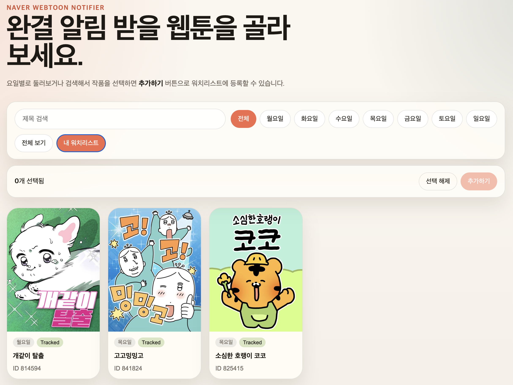

# Naver Webtoon Completion Notifier

[한국어 README](./README.ko.md)

Track Naver Webtoons in your own GitHub repository and get Telegram alerts when a tracked series finishes.

This repo is meant to be copied and used in your own account. It is not a centralized hosted service.

## What This Repo Does

After setup, your copy of this repo will:

- show a visual webtoon picker on GitHub Pages
- save your tracked titles in `watchlist.json`
- check those titles with GitHub Actions
- send a Telegram message when a tracked webtoon is completed

## How It Works

```text
GitHub Pages
  -> you choose webtoons
  -> GitHub issue is created

Process Subscription Request
  -> updates watchlist.json

Check Webtoon Completions
  -> checks tracked titles
  -> updates state
  -> sends Telegram alerts
```

## Setup

### 1. Copy the repo

Use one of these:

- `Use this template`
- `Fork`

### 2. Add Telegram secrets

In your copied repository, add these GitHub secrets:

- `TELEGRAM_BOT_TOKEN`
- `TELEGRAM_CHAT_ID`

### 3. Enable workflows

In the Actions tab, enable:

- `Check Webtoon Completions`
- `Process Subscription Request`

### 4. Enable GitHub Pages

In `Settings -> Pages`:

- Source: `Deploy from a branch`
- Branch: `main`
- Folder: `/docs`

Your site will be available at:

`https://<your-name>.github.io/<your-repo>/`

### 5. Initialize the catalog

Run `Check Webtoon Completions` once manually.

That first run generates:

- `docs/catalog.json`
- `docs/tracked.json`

Without this step, the page will load but the webtoon list will be empty.

## Using the Web UI

On the GitHub Pages site:

1. Browse by weekday or search by title.
2. Select one or more webtoons.
3. Click `Add` to track them.
4. Submit the generated GitHub issue.
5. Wait for `Process Subscription Request` to update `watchlist.json`.

To remove titles:

1. Open `My Watchlist`.
2. Select one or more tracked titles.
3. Click `Remove`.
4. Submit the generated GitHub issue.

### Screenshots

Main picker view:


My Watchlist view:



## When Telegram Messages Are Sent

Telegram is used for completion alerts, not for adding titles.

You get a Telegram message when:

- a tracked webtoon is detected as completed
- or you manually run the notification test

You do not get a Telegram message immediately when adding a title on the web page.

## Optional Local CLI

If you prefer local commands too:

```bash
git clone https://github.com/YOUR_USERNAME/naver-webtoon-notifier.git
cd naver-webtoon-notifier
python3 -m venv .venv
source .venv/bin/activate
pip install -r requirements.txt

python src/manage.py browse mon
python src/manage.py search "webtoon title"
python src/manage.py add 822557
python src/manage.py remove 822557
python src/manage.py list
python src/manage.py check
```

## Main Files

```text
src/
├── catalog.py
├── export_catalog.py
├── process_subscription_issue.py
├── manage.py
├── naver_api.py
├── detector.py
├── notifier.py
├── check.py
└── watchlist.py

docs/
├── index.html
├── app.js
├── styles.css
├── catalog.json
└── tracked.json
```

## Notes

- `catalog.json` is generated by GitHub Actions
- `tracked.json` contains the currently tracked `title_id` values
- the whole setup is optimized for low-cost, self-serve use
